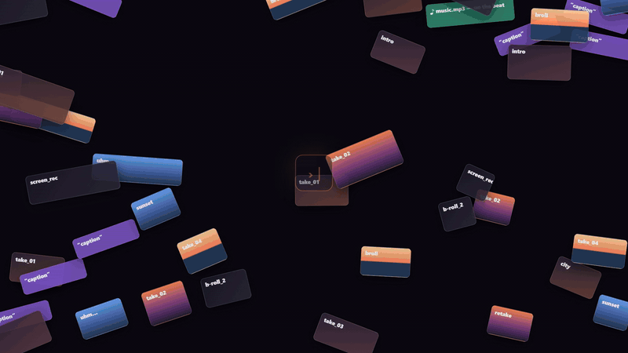

<p align="center"></p>

# vedit

> 🇬🇧 English version (and the PyPI page): [README.md](README.md).

Editor video non lineare con **tre modi di guidarlo sullo stesso motore**: un'interfaccia
web per montare a mano, un assistente in chat dentro l'editor, e un server MCP per farci
lavorare un agente da fuori.



## Installazione — 3 passi

**1. Installa uv** (installa le app Python al posto tuo). Poi **chiudi e riapri il terminale**.

| Windows (PowerShell) | macOS | Linux |
|---|---|---|
| `winget install astral-sh.uv` | `brew install uv` | `curl -LsSf https://astral.sh/uv/install.sh \| sh` |

**2. Installa vedit e ffmpeg**

```bash
uv tool install vedit-mcp
vedit install-ffmpeg
```

Se il terminale dice che `vedit` non è riconosciuto: `uv tool update-shell`, poi chiudi e
riapri il terminale.

**3. Apri l'editor**

```bash
vedit ui
```

Si apre nel browser su <http://127.0.0.1:8760>. Fatto.

**Facoltativo — far montare a Claude Code:** `claude mcp add vedit -- vedit-mcp`. Questo
collega soltanto Claude Code a vedit, non installa niente: prima fai il passo 2.

Qualcosa non va? `vedit doctor` dice cosa manca e come sistemarlo.

---

Il progetto è un documento JSON. Il render è una funzione pura di quel documento, compilata
in un unico `filter_complex` di ffmpeg: niente stato nascosto, lo stesso progetto produce
sempre lo stesso file. Ed è il motivo per cui i tre modi non possono divergere — passano
tutti dalle stesse operazioni.

---

## Indice

- [Installazione — 3 passi](#installazione--3-passi)
- [Usarlo senza installare niente](#usarlo-senza-installare-niente)
- [Installazione in un comando (per modificarlo)](#installazione-in-un-comando-per-modificarlo)
- [Darlo in mano a un agente](#darlo-in-mano-a-un-agente)
- [Requisiti](#requisiti)
- [Installazione](#installazione)
- [Avvio](#avvio)
- [L'interfaccia, pannello per pannello](#linterfaccia-pannello-per-pannello)
  - [Media](#1-media-pannello-sinistro-scheda-media)
  - [Libreria](#2-libreria-pannello-sinistro-scheda-libreria)
  - [Monitor e anteprima](#3-monitor-e-anteprima-centro)
  - [Timeline e tracce](#4-timeline-e-tracce-in-basso)
  - [Proprietà](#5-proprietà-pannello-destro-scheda-proprietà)
  - [Assistente](#6-assistente-pannello-destro-scheda-assistente)
  - [Esportare](#7-esportare)
- [Scorciatoie da tastiera](#scorciatoie-da-tastiera)
- [Riga di comando](#riga-di-comando)
- [Uso da agente (MCP)](#uso-da-agente-mcp)
- [Cosa sa fare](#cosa-sa-fare)
- [Keyframe](#keyframe)
- [Come è fatto](#come-è-fatto)
- [Test](#test)
- [Limiti noti](#limiti-noti)

---

## Usarlo senza installare niente

I tre passi sono [in cima alla pagina](#installazione--3-passi). Dettagli:

- Su PyPI il pacchetto si chiama **`vedit-mcp`** (il nome `vedit` era occupato; i comandi
  restano `vedit` e `vedit-mcp`). L'interfaccia compilata è già dentro: niente da costruire.
- `claude mcp add` *registra* soltanto il server in Claude Code, non installa niente. Senza il
  passo 2 il comando `vedit` non esiste.
- Senza installare in modo permanente: `uvx --from vedit-mcp vedit ui` lo scarica e lo avvia.
- Con pipx: `pipx install vedit-mcp` equivale a `uv tool install`.

Per gli altri client la stessa cosa in JSON (Cursor `.cursor/mcp.json`, Codex, VS Code):

```json
{ "mcpServers": { "vedit": { "command": "vedit-mcp", "args": [] } } }
```

**ffmpeg** è l'unica cosa che pip non può portare con sé, perché è un programma e non un
pacchetto Python. Se manca, non serve cercarlo in giro: `vedit install-ffmpeg` scarica una
build statica (ffmpeg *e* ffprobe) dentro `~/.vedit/bin` — niente amministratore, niente
modifiche al sistema, si disinstalla cancellando la cartella. L'agente ha lo stesso comando
come strumento `install_ffmpeg`. Se ffmpeg è già nel `PATH`, resta quello preferito: di solito
ha più encoder hardware.

Da agente si lavora a parole e si apre l'interfaccia solo quando serve guardare o mettere le
mani: lo strumento **`open_ui`** avvia l'editor nel browser **sullo stesso progetto in
memoria**, quindi le modifiche dell'agente si vedono subito nella timeline e viceversa, senza
salvare o riaprire niente.

**Non serve VS Code.** Chi scarica vedit lancia `vedit ui` (o `uvx --from vedit-mcp vedit ui`)
e lavora nel browser; l'assistente dentro l'app puo' essere Claude Code stesso (vedi
*Assistente*). E l'editor aperto **e' anche un server MCP**, su
`http://127.0.0.1:8760/mcp/`: chi si collega li' lavora sul progetto che si vede nel browser.

```bash
claude mcp add --transport http vedit-live http://127.0.0.1:8760/mcp/
```

---

## Installazione in un comando (per modificarlo)

```bash
git clone https://github.com/metiutek/editorvideo-ai.git
cd editorvideo-ai
python scripts/setup.py
```

Lo script fa tutto: dipendenze Python, interfaccia web compilata, server MCP registrato,
`vedit doctor` e i test veloci come verifica. Stampa una riga per passo e alla fine dice cosa
manca ancora e come rimediare. Rilanciarlo è sicuro: quello che è già a posto viene saltato.

```bash
python scripts/setup.py --venv             # dipendenze in .venv invece che nell'interprete corrente
python scripts/setup.py --install-ffmpeg   # prova a installare ffmpeg con winget / brew / apt
python scripts/setup.py --no-frontend      # solo CLI e MCP, niente interfaccia web
python scripts/setup.py --rebuild          # ricompila la UI dopo aver toccato frontend/src
python scripts/setup.py --json             # esito come JSON, per gli script e per gli agenti
```

Poi:

```bash
vedit ui                                   # http://127.0.0.1:8760
```

L'unica cosa che lo script non può inventarsi è **ffmpeg**: se manca e `--install-ffmpeg` non
riesce, installalo a mano ([ffmpeg.org](https://ffmpeg.org/download.html)) o indica i binari con
`VEDIT_FFMPEG` / `VEDIT_FFPROBE`. Chi preferisce i passaggi a mano li trova in
[Installazione](#installazione).

---

## Darlo in mano a un agente

Serve solo l'indirizzo della repo. Da incollare al proprio agente di codice:

> Clona `https://github.com/metiutek/editorvideo-ai.git`, entra nella cartella, leggi `AGENTS.md`
> e installa tutto seguendo quelle istruzioni. Poi dimmi com'è andata.

`AGENTS.md` (che `CLAUDE.md` importa, così vale per Claude Code, Codex, Cursor e gli altri)
contiene il comando di installazione, i guasti tipici col rimedio, come verificare, la mappa
del codice con le regole per modificarlo e l'uso del server MCP. Con Claude Code c'è anche il
comando `/setup`, che installa e riferisce l'esito.

Finita l'installazione l'agente può **usare** l'editor, non solo compilarlo: `.mcp.json` è già
nella repo e lo script lo allinea all'interprete giusto, quindi il server `vedit` coi suoi
strumenti è disponibile subito (vedi [Uso da agente](#uso-da-agente-mcp)).

---

## Requisiti

| | |
|---|---|
| Python | 3.10 o più recente |
| ffmpeg e ffprobe | nel `PATH`, scaricati con `vedit install-ffmpeg`, o indicati con `VEDIT_FFMPEG` / `VEDIT_FFPROBE` |
| Node.js | 18+, serve **solo** per compilare l'interfaccia la prima volta |
| GPU | facoltativa. NVIDIA/Intel/AMD vengono rilevate e usate da sole per il render |

Verifica ffmpeg con `ffmpeg -version`. Se manca: [ffmpeg.org/download](https://ffmpeg.org/download.html)
(su Windows la build "essentials" di gyan.dev va benissimo).

---

## Installazione

Gli stessi passi che fa `python scripts/setup.py`, uno per uno, per chi li vuole in mano.

```bash
git clone https://github.com/metiutek/editorvideo-ai.git
cd editorvideo-ai

pip install -e .                 # installa i comandi vedit e vedit-mcp
vedit doctor                     # controlla ffmpeg, encoder GPU, filtri disponibili

cd frontend
npm install
npm run build                    # compila l'interfaccia in frontend/dist
cd ..
```

`npm run build` va rifatto solo se modifichi il codice dell'interfaccia. Se ti dimentichi,
il server te lo dice invece di mostrare una pagina bianca.

**Assistente in chat (facoltativo).** Il modello si sceglie dentro l'app, nella scheda
*assistente*: Claude Code installato sul computer (nessuna chiave), Claude con chiave API,
oppure qualunque servizio compatibile OpenAI (OpenAI, Gemini, OpenRouter, Ollama…). Per usare
Claude con la chiave serve il pacchetto `anthropic`:

```bash
pip install -e ".[chat]"                     # aggiunge il pacchetto anthropic
```

Senza modello configurato tutto il resto funziona identico: la scheda *assistente* mostra
cosa manca invece di fingere di andare.

**Riconoscimento del soggetto (facoltativo).** `detect_subjects`, `track_mask` e
`auto_reframe` usano YOLO, che si tira dietro torch — sono giga, quindi non arrivano
con l'installazione normale:

```bash
pip install -e ".[vision]"                   # aggiunge ultralytics
```

**Trascrizione e sottotitoli (facoltativo).** `transcribe`, `make_captions`,
`tighten_speech` e `censor_speech` girano su faster-whisper, che scarica un modello
e macina CPU:

```bash
pip install -e ".[transcribe]"               # aggiunge faster-whisper
```

**Grafica HTML (facoltativo).** Al render le clip html le fotografa Chromium tramite
Playwright, che usa Chrome o Edge gia' installati (senza: `python -m playwright install
chromium`). L'anteprima dal vivo nell'interfaccia funziona anche senza:

```bash
pip install -e ".[html]"                     # aggiunge playwright
```

**Plugin audio (facoltativo).** I plugin VST3 (e AU su Mac) li carica pedalboard; i vecchi
VST2 (`.dll`) non sono supportati:

```bash
pip install -e ".[plugin]"                   # aggiunge pedalboard
```

Senza gli extra, quegli strumenti dicono cosa manca e il resto dell'editor non se ne
accorge. `numpy` e Pillow invece arrivano sempre: non sono extra, ci stanno sopra
l'analisi del girato, il montaggio a tempo di musica e `preview_grid`.

---

## Avvio

```bash
vedit ui                                     # apre il browser su http://127.0.0.1:8760
vedit ui --project miofilm.json              # aprendo già un progetto
vedit ui --port 9000 --no-browser            # su un'altra porta, senza aprire il browser
```

Il primo progetto lo crei con **nuovo** nella barra in alto: scegli il file `.json` e il
formato (`1080p`, `4k`, `vertical` per reel e short, `square`, …). Il `.json` è il progetto:
i video restano dove sono, non vengono copiati.

Un progetto nuovo parte con **una traccia video e una audio**. Ne aggiungi quante ne vuoi,
quando ti servono (vedi [Timeline e tracce](#4-timeline-e-tracce-in-basso)).

---

## L'interfaccia, pannello per pannello

```
┌──────────────────────────────────────────────────────────────────────┐
│  barra: nuovo · apri · salva · ↶↷ · +video +audio +testo · esporta   │
├───────────────┬──────────────────────────────────┬───────────────────┤
│ media         │  programma / sorgente            │ proprietà         │
│ libreria      │  ┌────────────────────────────┐  │ assistente        │
│               │  │      anteprima             │  │                   │
│  (schede)     │  └────────────────────────────┘  │   (schede)        │
│               │  ▶ ⏮  0:01.2/0:13.0  zoom tracce │                   │
│               ├──────────────────────────────────┤                   │
│               │  timeline: V3 V2 V1 A1 …         │                   │
└───────────────┴──────────────────────────────────┴───────────────────┘
```

Le zone si ridimensionano trascinando i divisori tra loro; le misure restano salvate.

### 1. Media (pannello sinistro, scheda *media*)

- **`+`** importa file *lasciandoli dove sono*.
- **Trascinare file dal desktop** dentro la finestra li **copia** in `media/` accanto al
  progetto (il browser non passa il percorso di origine). Per file pesanti usa `+`.
- **`📁+`** crea una cartella: è solo un'etichetta sul media, non sposta niente su disco.
- **Clic** su un media lo apre nel monitor *sorgente*; **doppio clic** lo accoda in timeline;
  **trascina** su una traccia per metterlo dove vuoi.

### 2. Libreria (pannello sinistro, scheda *libreria*)

Look, catene audio e transizioni già tarate, con un nome invece di venti parametri.

| Scheda | Contenuto |
|---|---|
| **look** | Colore (cinema teal & orange, bianco e nero, caldo tramonto, sbiadito pellicola…), Stilizzati (VHS, sogno, censura), Ritocco (nitido, pulisci ripresa, vignettatura, stabilizza) |
| **audio** | Voce (voce pulita, voce radiofonica), Effetti (telefono, sala grande, eco), Musica (musica sotto la voce, volume costante) |
| **transizioni** | dissolvenza, iris, tendina e scorrimento nelle quattro direzioni |

- **Clic** applica alla clip selezionata. Un look video senza clip selezionata va sul
  **master**, cioè su tutto il video. In fondo al pannello c'è sempre scritto su cosa finirà.
- **Trascina** un preset **sopra una clip** in timeline per applicarlo a quella.
- Un preset è solo una catena di effetti: si annulla con **un solo** Ctrl+Z e resta tutto
  regolabile dal pannello proprietà.

### 3. Monitor e anteprima (centro)

Due schede: **programma** (la timeline) e **sorgente** (un media da solo).

- Da fermo l'anteprima è il fotogramma **renderizzato da ffmpeg**, quindi identico al
  risultato finale, effetti compresi.
- **▶** riproduce segmenti da 12s preparando il successivo in sottofondo. Il primo segmento
  va atteso; premi **proxy** nella barra in alto per rendere tutto molto più rapido.
- Con una clip selezionata compare il **riquadro di trasformazione**: trascina l'immagine per
  spostarla, gli angoli per ridimensionarla.
- Nel monitor *sorgente*: `[` e `]` segnano attacco e stacco, poi **inserisci** mette solo
  quel pezzo alla testina — o lo trascini sulla traccia che vuoi.

### 4. Timeline e tracce (in basso)

**Le tracce non hanno un numero fisso.** Un progetto nuovo ne ha una video e una audio; le
altre si aggiungono con **`+ video`** / **`+ audio`** nella riga in fondo alla colonna dei
nomi (accanto c'è il conteggio: `3 video · 1 audio`). Gli stessi pulsanti sono anche nella
barra in alto.

Ogni traccia ha la sua testata:

| Comando | Cosa fa |
|---|---|
| **nome** | doppio clic per rinominarla (`riprese`, `titoli`, `musica`…) |
| **▲ ▼** | sposta la traccia. Per il video l'ordine **è** la sovrapposizione: più in alto = disegnata sopra |
| **👁 / 🔊** | nasconde il video / silenzia l'audio |
| **S** | *solo*: isola la traccia, le altre dello stesso tipo escono dal render |
| **🔒** | blocca: protegge le clip da spostamenti, tagli, effetti ed eliminazioni. È anche l'unico modo di sbloccarla |
| **✕** | elimina la traccia (chiede conferma se contiene clip) |
| **cursore** | volume della traccia |

Una traccia esclusa dal render si vede subito: corsia sbiadita e nome barrato. Una bloccata
ha il tratteggio diagonale.

Sulle clip:

- **trascina** per spostarle, anche **da una traccia all'altra**;
- **trascina i bordi** per tagliarle;
- aggancio automatico ai bordi delle altre clip e alla testina;
- le clip video mostrano i fotogrammi, quelle audio la forma d'onda.

Sotto la barra di trasporto ci sono due cursori: **zoom** (scala dei tempi) e **tracce**
(altezza). Abbassa l'altezza per tenerne una ventina sott'occhio: sotto una certa soglia
sparisce solo il cursore del volume, i pulsanti restano tutti.

> **Le tracce video servono a sovrapporre.** Un titolo sulla stessa traccia di una ripresa
> ci sta, ma per un PiP, un logo o due riprese sovrapposte a piacere serve una traccia in più.

### 5. Proprietà (pannello destro, scheda *proprietà*)

Con una clip selezionata: nome, inizio, durata, attacco, inquadratura, velocità e reverse,
dissolvenze, transizione in uscita, posizione/scala/rotazione/opacità, audio (volume in dB,
pan, dissolvenze), effetti.

Il pulsante **◆** accanto a un parametro lo rende **animato**: compare l'editor dei keyframe,
con i tempi relativi all'inizio della clip.

Senza selezione mostra il progetto: risoluzione, fps, sfondo, normalizzazione EBU R128 del
mix ed effetti sul master.

### 6. Assistente (pannello destro, scheda *assistente*)

Chiedi una modifica in italiano e viene fatta sul progetto:

> «togli i primi 2 secondi della prima clip»
> «metti una dissolvenza tra le due riprese»
> «rendi il video più cinematografico»
> «sposta la musica su una traccia sua e abbassala di 6 dB»

Gli strumenti che usa **sono le stesse operazioni dei pulsanti**: quello che fa compare in
timeline e lo annulli con Ctrl+Z, esattamente come una tua modifica. Sotto ogni risposta
vedi la lista di cosa ha toccato. Il cestino ricomincia la conversazione.

**Scegli il modello** dalla pastiglia in alto nella scheda, senza variabili d'ambiente e
senza riavviare:

- **Claude Code** installato sul computer: usa il tuo abbonamento, nessuna chiave. Lavora sul
  progetto aperto attraverso il server MCP dell'editor stesso, quindi vedi ogni modifica
  comparire in timeline mentre la fa;
- **Anthropic** (Claude) con una chiave API;
- qualunque servizio che parla il protocollo **chat/completions di OpenAI**: OpenAI, Google
  Gemini, OpenRouter, Groq, Mistral, DeepSeek, xAI, i modelli locali di **Ollama** o
  **LM Studio**, o un indirizzo qualsiasi che incolli tu.

Le chiavi restano su questo computer in `~/.vedit/llm.json`, mai nel file di progetto.

**Indica i punti.** Sotto la casella del messaggio: **istante** (la testina), **tratto**
(inizio, sposti, fine), **clip** (quella selezionata, oppure "chiedi" nelle sue proprietà),
**area** (disegni un riquadro sull'inquadratura). Ognuno diventa una pastiglia numerata:
scrivi «ingrandisci il titolo nel 2» e il modello riceve il riferimento con il fotogramma
davanti — l'area segnata in rosso, e la sua posizione già convertita negli `x`/`y` di
`set_transform`. Allo stesso modo si aggiungono file (trascinati o incollati, anche uno
screenshot), link (una pagina arriva come testo, un video diretto viene scaricato) e cartelle.

**Chiede, non decide al posto tuo.** Quando una scelta spetta a te — stile, durata, formato,
quale versione tenere — l'assistente mostra una scheda di domande con le opzioni da cliccare
(`ask_user`, disponibile anche a qualunque agente MCP collegato all'editor aperto). **Non
esporta mai di sua iniziativa**: dentro l'editor ogni `render_video` prima ti chiede conferma,
e senza un sì non scrive niente. Ogni passaggio dice su cosa lavora e si apre sui parametri
esatti; **ferma** lo interrompe a metà.

**Stili di montaggio.** Ne scegli uno dalla pastiglia nella chat — cinematografico,
dinamico/social, documentario, vlog, trailer, videoclip, minimal, retro/VHS — e guida ogni
scelta: ritmo dei tagli, transizioni, colore, titoli, musica.

### 7. Esportare

**esporta** apre la finestra di render: file di destinazione, qualità
(`bozza` / `media` / `alta` / `massima`), codec (H.264, HEVC, AV1, VP9) ed eventualmente solo
una porzione della timeline. L'estensione decide il contenitore: `.mp4` `.mov` `.mkv`
`.webm` `.gif` `.mp3` `.wav`. La barra mostra l'avanzamento reale di ffmpeg.

Il render finale usa **sempre gli originali**, mai i proxy.

---

## Scorciatoie da tastiera

| Tasto | Azione |
|---|---|
| `spazio` | play / pausa |
| `←` `→` | un fotogramma (con `shift`: un secondo) |
| `Home` / `Fine` | inizio / fine |
| `S` | taglia alla testina |
| `Canc` | elimina la clip (con `shift`: chiude il buco) |
| `Ctrl+Z` / `Ctrl+Y` | annulla / ripeti |
| `+` `-` | zoom della timeline |

---

## Riga di comando

Tutto quello che fa l'interfaccia si fa anche da terminale, sullo stesso file di progetto.

```bash
vedit new progetto.json --preset 1080p
vedit import progetto.json riprese/*.mp4 musica.mp3
vedit info progetto.json                 # media e timeline con gli id
vedit add progetto.json m1a2b3c4 --duration 8
vedit proxy progetto.json                # proxy 540p: anteprime molto più rapide
vedit frame progetto.json 12.5 controllo.jpg
vedit normalize progetto.json --lufs -14
vedit render progetto.json finale.mp4 --quality high
vedit effects video                      # catalogo effetti e parametri
vedit doctor                             # ffmpeg, encoder, filtri
vedit ui                                 # interfaccia web
```

Preset di formato: `1080p`, `1080p60`, `4k`, `720p`, `vertical` (9:16), `vertical60`, `square`.

---

## Uso da agente (MCP)

Il file `.mcp.json` è già pronto: aprendo Claude Code in questa cartella il server `vedit`
viene proposto al primo avvio (va approvato una volta). Altrove:

```bash
claude mcp add vedit -- vedit-mcp
```

Per gli altri client (Cursor, Codex, VS Code) la configurazione equivalente e il flusso
consigliato degli strumenti stanno in [`AGENTS.md`](AGENTS.md).

77 strumenti: creazione progetto, import, taglio/split/trim, tracce (aggiungere,
riordinare, solo, blocco), velocità e reverse, transform con keyframe, effetti video e audio,
dissolvenze incrociate, normalizzazione EBU R128, render, e `preview_frame` che **restituisce
l'immagine vera** del fotogramma — così l'agente vede quello che ha montato invece di
indovinarlo.

> **Un progetto alla volta per file.** Interfaccia e server MCP salvano da soli dopo ogni
> modifica: se tieni lo stesso `.json` aperto in tutti e due contemporaneamente, l'ultimo che
> salva vince. Lavora su uno per volta.

---

## Cosa sa fare

**Montaggio** — taglio, split, trim, spostamento anche tra tracce, ripple delete, chiusura
buchi, tracce video e audio in numero libero con ordine, solo e blocco, cartelle nel bin,
undo/redo.

**Transizioni** — dissolvenza, tendina nelle quattro direzioni, scorrimento nelle quattro
direzioni, iris. La clip successiva viene accostata e sovrapposta in automatico; l'audio
incrocia sempre in dissolvenza.

**Velocità** — da 0.01x a 100x con audio in tempo (`atempo` a catena), reverse, motion blur o
interpolazione di frame per lo slow motion.

**Colore** — esposizione in stop, luminosità, contrasto, saturazione, gamma (animabili),
vividezza, bilanciamento del bianco (temperatura e tinta verde-magenta) e automatico,
lift/gamma/gain per canale su ombre, mezzitoni e luci, livelli, rotazione della tonalità,
correzione di una sola famiglia di colori (cielo più blu, erba meno gialla), curve, LUT
`.cube`. Ogni strumento colore ha un test che lo renderizza e controlla in che direzione si
spostano i pixel.

**Composizione** — posizione, scala, rotazione, opacità per clip, tutte animabili con keyframe
ed easing; PiP, overlay grafici, testi con box/bordo/ombra, chroma key, ritaglio, specchio,
pixelate, vignettatura, grana, glow, stabilizzazione.

**Grafica animata in HTML** — `add_html` mette in traccia un documento HTML/CSS/JS come una
clip: sottopancia, titoli animati, contatori, infografiche, schermate intere. Lo sfondo e'
trasparente e lascia vedere la ripresa sotto. L'orologio della pagina e' quello della clip:
animazioni e transizioni CSS, Web Animations, GSAP, `requestAnimationFrame` e `setTimeout`
avanzano un fotogramma alla volta, oppure definisci `window.veditRender = t => …` e disegni
tu ogni fotogramma. Nell'interfaccia la clip gira **dal vivo** in un iframe che segue la
testina, e il sorgente si modifica nel pannello proprieta' mentre scorre. Al render Chromium
ripassa gli stessi fotogrammi e li cattura con l'alpha: quello che hai visto e' quello che
esce.

**Audio** — guadagno in dB (animabile), pan, dissolvenze, equalizzatore a 3 bande ed
**equalizzatore parametrico** (fino a dieci bande — campana, scaffali, passa-alto e passa-basso,
notch — con la curva da trascinare), compressore, **compressore sidechain** (la musica si
abbassa da sola quando parla la voce), limiter, riduzione rumore, gate, **de-esser**, riverbero,
eco, pitch shift, normalizzazione dinamica, normalizzazione EBU R128 a due passaggi sul mix e
**plugin VST3/AU** tramite pedalboard (scegli un plugin installato e regoli i suoi parametri nel
pannello).

---

## Keyframe

Ogni parametro animabile accetta, al posto di un numero, un blocco keyframe:

```json
{"kf": [{"t": 0, "v": 1.0, "ease": "ease_in_out"}, {"t": 3, "v": 1.4}]}
```

`t` è il tempo **relativo all'inizio della clip**. Easing: `linear`, `hold`, `ease_in`,
`ease_out`, `ease_in_out` e le varianti `_cubic`.

I keyframe diventano espressioni ffmpeg valutate frame per frame: l'animazione non costa un
passaggio di render in più.

---

## Come è fatto

```
backend/vedit/
  model.py       documento di progetto (dataclass <-> JSON)
  keyframes.py   keyframe -> espressioni ffmpeg
  effects.py     registro effetti: parametri, validazione, filtri
  presets.py     look, catene audio e transizioni già tarate
  graph.py       timeline -> filter_complex
  render.py      esecuzione, progresso, analisi (loudness, stabilizzazione)
  proxy.py       proxy, forme d'onda, miniature
  store.py       operazioni di editing + undo/redo + salvataggio
  chat.py        assistente: gli strumenti sono le operazioni di store
  mcp_server.py  strumenti MCP
  api.py         API REST/WebSocket per la UI
  cli.py         riga di comando
frontend/        interfaccia web (React + Vite)
tests/           test, inclusi render reali di ogni effetto
```

**Un solo punto di verità.** Interfaccia, assistente e agente MCP chiamano tutti i metodi di
`Store`. Non esiste una strada privilegiata per modificare il progetto, quindi non esiste il
caso "funziona da qui ma non da lì".

Note tecniche che spiegano le scelte meno ovvie:

- **Composizione**: canvas + un `overlay` per clip. Regge multi-traccia, PiP e dissolvenze
  senza casi particolari.
- **Posizionamento**: `tpad` con frame trasparenti invece di spostare i PTS, così `overlay`
  non resta in attesa di frame.
- **Ordine di disegno**: le tracce video si sovrappongono nell'ordine della lista. Dentro una
  traccia, la clip che inizia prima sta sopra (così la sua transizione in uscita scopre quella
  dopo); titoli e colori pieni fanno eccezione e stanno sempre sopra i media.
- **Anteprima**: `slice_project` ritaglia la porzione richiesta, quindi rendere il secondo 300
  non costa più che rendere il secondo 3. Le clip tagliate conservano il proprio tempo
  d'origine, così una dissolvenza inquadrata a metà mostra il fotogramma giusto — c'è un test
  che confronta anteprima e render finale.
- **Transizioni**: sfruttano l'ordine di disegno. Tendine e iris cancellano pixel della clip in
  uscita con una maschera `geq` sull'alpha; lo scorrimento aggiunge un termine alle espressioni
  `x`/`y` dell'overlay. Nessun secondo ramo del grafo, nessun costo di composizione in più.
- **Strisce di fotogrammi**: una sola immagine per media (`tile`), posizionata via CSS in base
  ad attacco, velocità e zoom. Zoomare la timeline non genera nessuna richiesta.
- **Cache di anteprima**: ogni fotogramma e ogni segmento vengono scritti su un file
  temporaneo e spostati a destinazione solo a lavoro finito. Senza, il player riceverebbe un
  mp4 ancora senza atomo `moov` e la riproduzione non partirebbe.
- **Salvataggio**: stessa idea, `os.replace` atomico. Un'interruzione a metà non può lasciare
  un progetto troncato.
- **Filtergraph su file** (`-filter_complex_script`): le timeline lunghe superano il limite di
  32k caratteri della riga di comando di Windows.

---

## Test

```bash
pytest                  # tutto, render reali inclusi (~50s)
pytest -m "not slow"    # solo logica, senza ffmpeg

cd frontend
node test-util.mjs                       # funzioni pure della UI
npm run build && node smoke.mjs          # monta la UI compilata in jsdom
```

78 test Python: keyframe, operazioni di editing, compilazione del grafo, un render reale per
ognuno dei 28 effetti e delle 10 transizioni, corrispondenza tra anteprima e render finale,
strumenti MCP, API della UI, riga di comando.

---

## Limiti noti

- L'opacità animata e le tendine usano `geq` (valutazione per pixel): funzionano ma rallentano
  il render. Dissolvenze e scorrimenti non hanno questo costo.
- La scala animata passa da `zoompan`: sotto 0.25x il valore viene limitato.
- La riproduzione in anteprima è a segmenti: il primo è da attendere, i successivi vengono
  preparati mentre guardi.
- I file trascinati dal desktop vengono copiati (il browser non passa il percorso di origine):
  per file grandi conviene il pulsante di import.
- Il riquadro di trasformazione non modifica i parametri animati: in quel caso si agisce sui
  keyframe.
- Se due processi tengono aperto lo stesso `.json` (per esempio interfaccia e server MCP), il
  salvataggio automatico dell'uno può sovrascrivere il lavoro dell'altro. Non c'è ancora un
  lock sul file di progetto.
